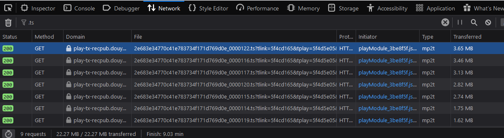

# 斗鱼录播下载助手
## 实现原理
    斗鱼会将完整的录播视频切分成10秒左右的片段，
    这些片段从0000000开始编号，
    这个脚本通过 status code 来获得结束编号，
    将所有的视频片段下载好之后会自动使用ffmpeg合并成完整的视频文件
## 使用方法
    1. git clone https://github.com/TDL3/DouYuVODDownloader.git
    2. cd DouYuVODDownloader
    3. pipenv install
    4. 打开浏览器，进入想要下载录播的网页
    5. F12打开开发者工具，切换到Network，在过滤选项中输入“.ts”（去掉双引号）
    6. 播放几秒钟的视频，可以获得类似 https://***_0000122.ts**** 的链接，复制此链接
    7. ./DouYuVODDownloader.py https://***_0000122.ts****

这个脚本只需要提供url就可以进行下载，同时你也可以通过"--path 路径", "--name 文件名" 来指定视频片段下载的路径和合并之后的文件名
e.g. ./DouYuVODDownloader.py --path "~/Downloads" --name "好想看录播" https://***_0000122.ts****